# EcholoKernel Agent Architecture

## Overview

EcholoKernel is an iterative optimization agent designed to automatically improve Triton/NVSHMEM kernel implementations. The agent follows a bootstrap → evaluate → propose → refine cycle, using LLM-based code generation with optional RAG (Retrieval-Augmented Generation) support for both example kernels and documentation.

## High-Level Architecture

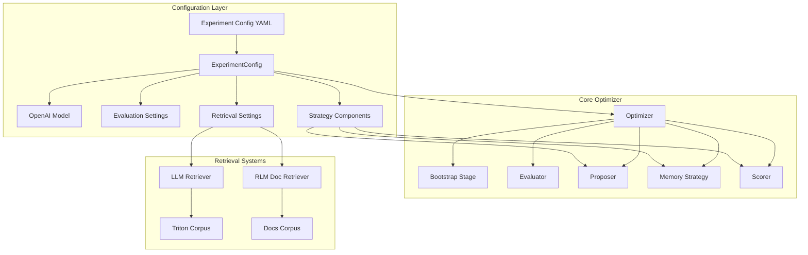

## Component Breakdown

### 1. Configuration System

The agent is driven by YAML configuration files that define:

- **Problems**: Problem IDs with dimensions (rows, cols) and data types
- **Strategies**: Which proposer, memory, and scorer to use
- **OpenAI Settings**: Model selection (e.g., gpt-5) and temperature
- **Evaluation**: Warmup/measurement iterations, timeouts, profiling
- **Retrieval**: Optional RAG for example kernels and documentation

**Example Configuration:**

```yaml
name: "problem30_agent_speedup"
max_iterations: 15
early_stop_speedup: 1.5
seed_from_backend: "triton"
candidate_dir: "solutions_agent"

problems:
  - problem_id: 30
    rows: 1024
    cols: 1024
    dtype: "float32"

retrieval:
  enabled: true
  top_k: 3
  docs_dir: "scraped_docs"
  rlm_max_iterations: 15
```

### 2. Bootstrap Stage

The bootstrap stage generates an initial candidate solution when none exists.

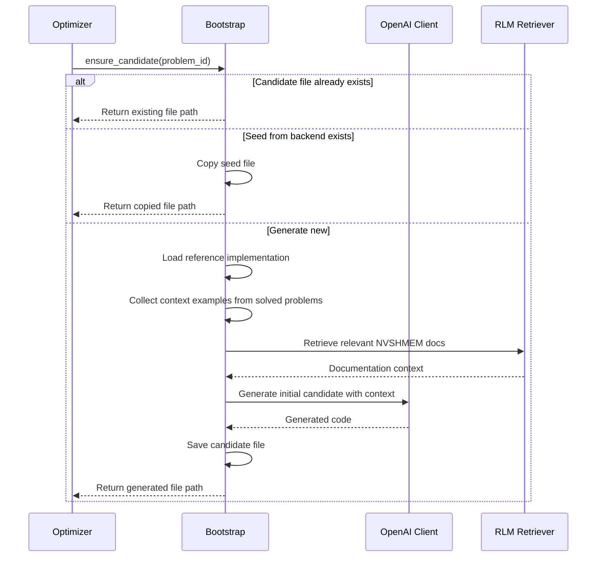

**Bootstrap Process:**
1. Check if candidate file exists (skip if present)
2. Try to copy from seed backend (e.g., `solutions_triton/`)
3. If no seed, generate from scratch using:
   - Reference implementation (CPU/NumPy version)
   - Solved examples from other problems
   - Retrieved NVSHMEM documentation (if RLM enabled)

### 3. Main Optimization Loop

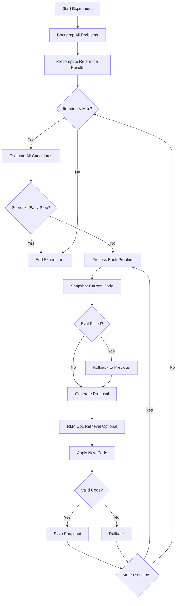

### 4. Evaluation System

The evaluator runs candidates on Modal (distributed GPU infrastructure) and compares them against reference implementations.

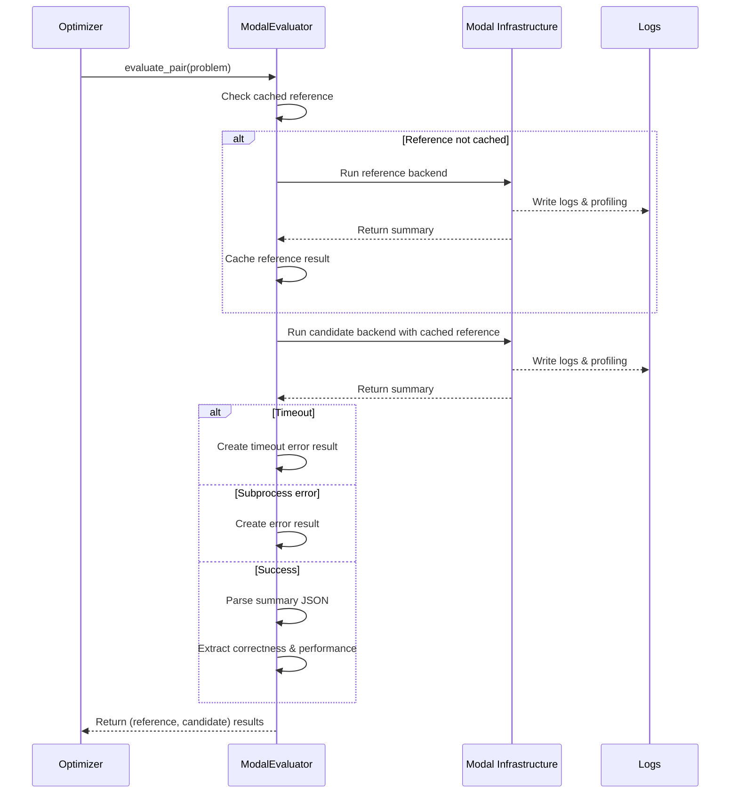

**Evaluation Results Include:**
- **Correctness**: Whether outputs match reference
- **Performance**: Timing data (mean, min, max, p50, p90, p99)
- **Status**: Success, error, or timeout
- **Profiling Data**: Optional GPU traces
- **Error Details**: Crash messages, timeout indicators

### 5. Proposal System

The proposer generates code improvements based on evaluation feedback.

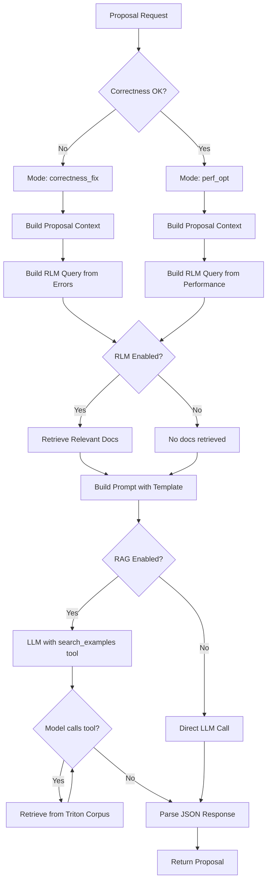

**Proposal Context:**
- Current candidate code
- Latest evaluation metrics
- Memory summary (historical best results)
- Retrieved documentation (RLM)
- Proposal mode (correctness vs. performance)

**Proposal Output:**
- **Diagnosis**: What's wrong or could be improved
- **Hypotheses**: Potential optimization strategies
- **Candidate Code**: Complete rewritten file
- **Test Expectations**: What should change after applying this

### 6. Retrieval Systems

EcholoKernel uses two retrieval systems:

#### A. Triton Corpus Retrieval (RAG for Examples)

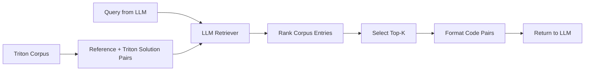

- Corpus contains paired (reference, optimized) Triton solutions
- LLM ranks examples by relevance to query
- Top-K most relevant examples returned
- Available as `search_examples` tool during proposal

#### B. Documentation Retrieval (RLM for Docs)

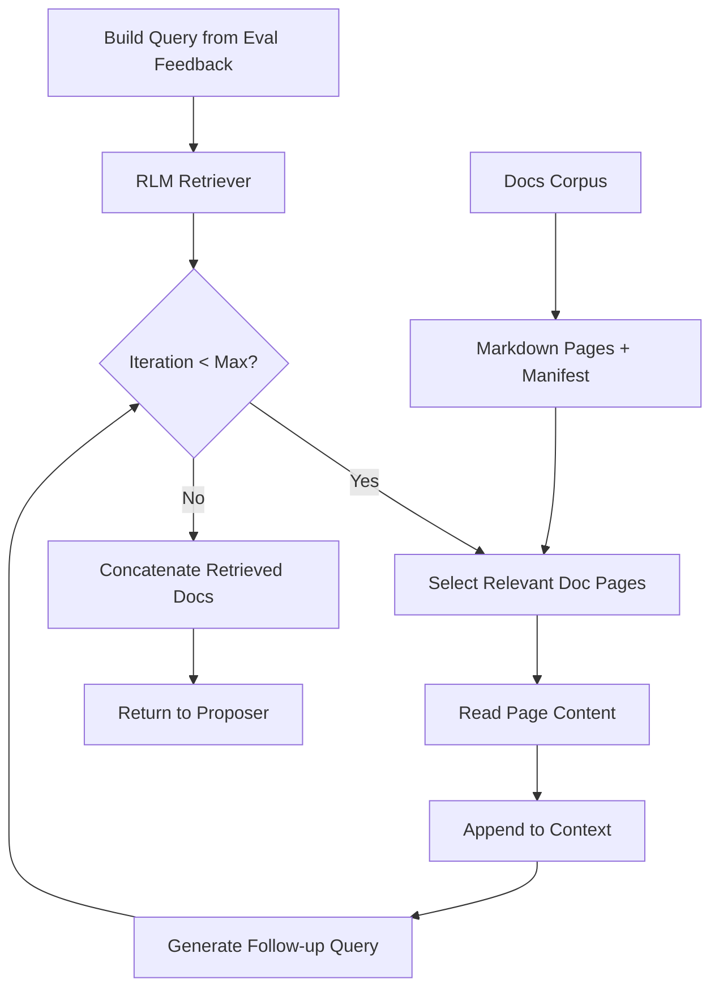

- RLM (Recursive Learning Module) iteratively retrieves documentation
- Query built from evaluation feedback (errors, timeouts, correctness issues)
- Multiple iterations narrow down to most relevant pages
- Retrieved docs injected into proposal prompt

### 7. Memory & Scoring

#### Memory Strategy

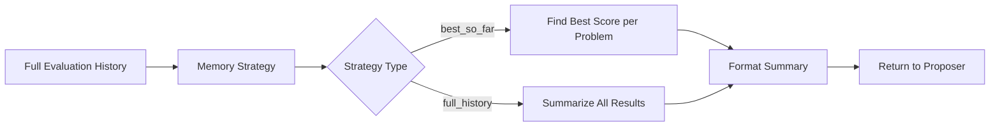

**Best-So-Far Strategy:**
- Tracks highest-scoring iteration for each problem
- Provides context of "what worked best" to guide optimization

#### Scorer

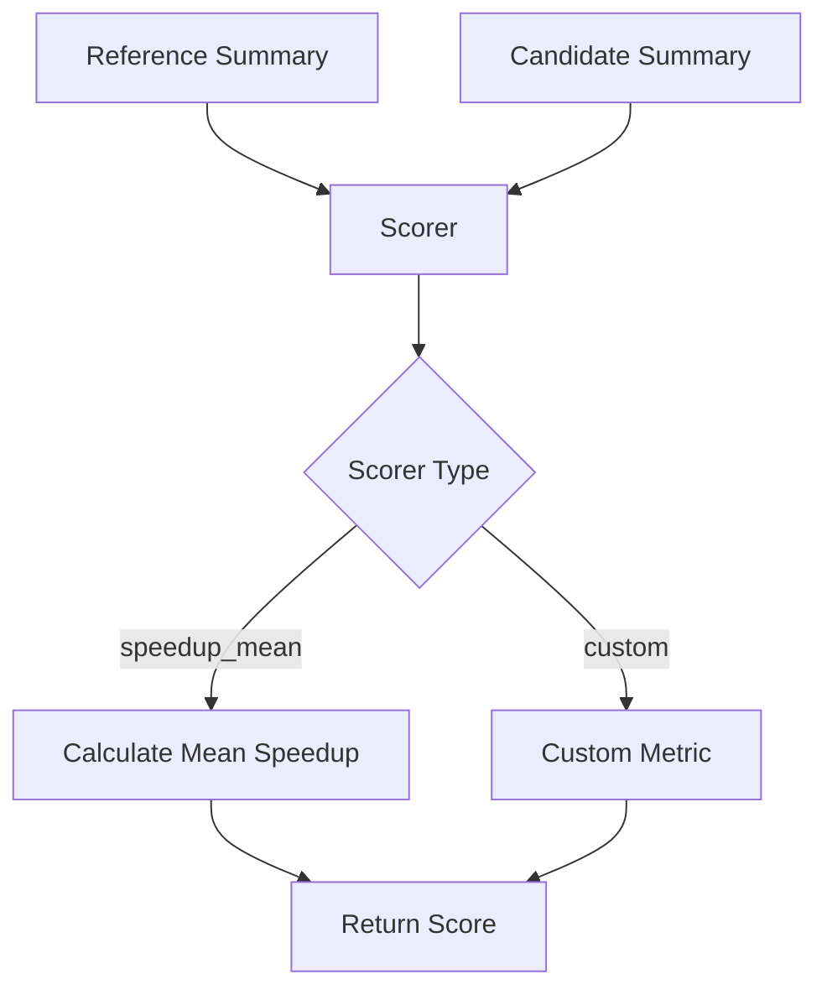

**Speedup Mean Scorer:**
- Compares candidate vs. reference timing
- Score = reference_time / candidate_time
- Score > 1.0 means speedup
- Score < 1.0 means slowdown

### 8. Rollback & Error Handling

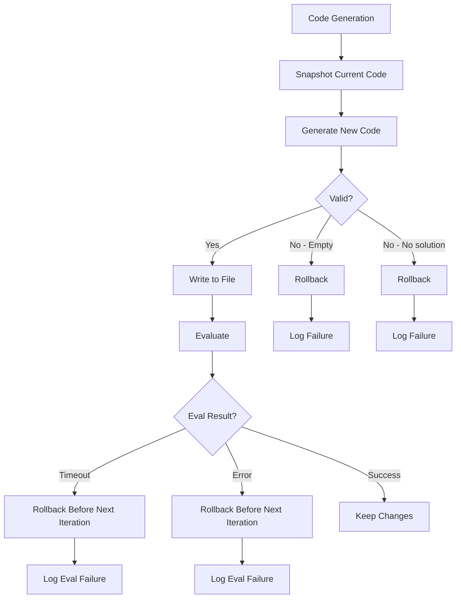

**Rollback Manager:**
- Takes snapshot before each code change
- Rolls back on:
  - Invalid code generation
  - Evaluation errors
  - Evaluation timeouts
- Prevents building on broken code

## Data Flow

### End-to-End Execution Flow

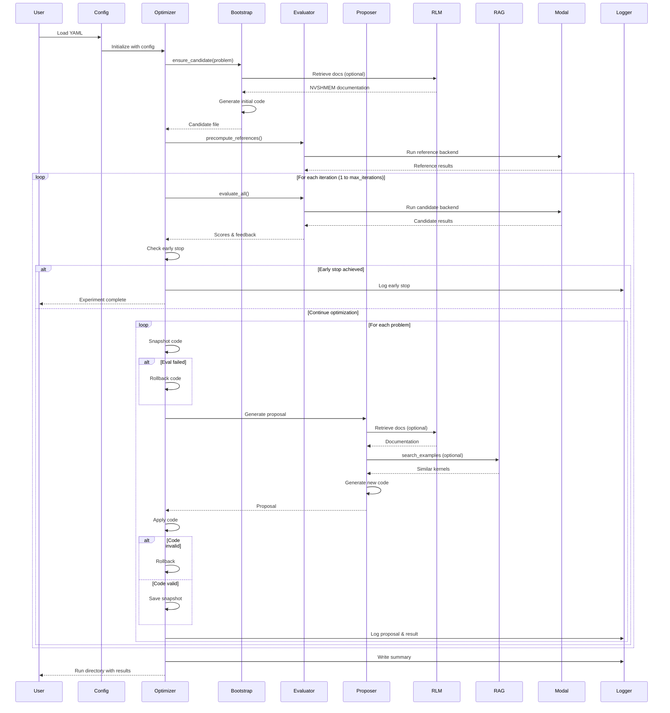

## Key Design Principles

### 1. **Iterative Refinement**
- Start with bootstrap or seed solution
- Evaluate → Propose → Apply → Repeat
- Each iteration builds on previous best results

### 2. **Dual-Mode Optimization**
- **Correctness Mode**: Fixes bugs, crashes, incorrect outputs
- **Performance Mode**: Optimizes speed while maintaining correctness
- Automatic mode switching based on evaluation feedback

### 3. **Failure Recovery**
- Rollback on invalid code generation
- Rollback after evaluation failures
- Continue optimization from last good state

### 4. **Context-Aware Retrieval**
- Dynamically retrieve relevant documentation based on errors
- Search example kernels on-demand during proposal
- Iterative documentation narrowing (RLM)

### 5. **Structured Logging**
- All proposals logged as JSONL
- Code snapshots for every iteration
- Complete evaluation traces
- Enables post-hoc analysis and replay

## File Organization

```
EcholoKernel/
├── agent/
│   ├── core/
│   │   ├── optimizer.py        # Main orchestration loop
│   │   ├── bootstrap.py        # Initial code generation
│   │   ├── rollback.py         # Snapshot & rollback manager
│   │   └── run_log.py          # JSONL logging
│   ├── strategies/
│   │   ├── proposers/
│   │   │   ├── base.py         # Proposer protocol
│   │   │   └── single_shot.py  # Standard LLM proposer
│   │   ├── memory/
│   │   │   ├── base.py         # Memory protocol
│   │   │   └── best_so_far.py  # Track best results
│   │   ├── scorers/
│   │   │   ├── base.py         # Scorer protocol
│   │   │   └── speedup_mean.py # Speedup metric
│   │   ├── retrieval/
│   │   │   ├── corpus.py       # Triton example corpus
│   │   │   ├── retriever.py    # LLM-based ranker
│   │   │   ├── docs_loader.py  # Documentation corpus
│   │   │   └── rlm_retriever.py # Recursive doc retriever
│   │   └── registry.py         # Strategy factory
│   ├── eval/
│   │   └── modal_evaluator.py  # Distributed evaluation
│   ├── config.py               # Configuration dataclasses
│   └── openai_client.py        # LLM API wrapper
├── experiments/
│   └── *.yaml                  # Experiment configs
├── runs/
│   └── <timestamp>_<name>/
│       ├── run_log.jsonl       # Event log
│       ├── llm_outputs.jsonl   # Proposal details
│       ├── snapshots/          # Code history
│       │   └── problem_<id>/
│       │       ├── iter_0_bootstrap.py
│       │       ├── iter_1.py
│       │       └── ...
│       └── summary.json        # Run metadata
├── solutions_agent/            # Current best candidates
├── solutions_triton/           # Optional seed solutions
├── reference/                  # Ground truth implementations
└── scraped_docs/               # NVSHMEM documentation
    ├── manifest.json
    └── markdown/
```

## Running the Agent

### Basic Execution

```bash
python -m agent.core.optimizer experiments/problem30.yaml
```

### Output Artifacts

After execution, the agent produces:

1. **Run Directory**: `runs/<timestamp>_<experiment_name>/`
2. **Event Log**: `run_log.jsonl` - all optimization events
3. **LLM Outputs**: `llm_outputs.jsonl` - detailed proposals
4. **Code Snapshots**: `snapshots/problem_<id>/` - evolution history
5. **Evaluation Logs**: `logs/problem_<id>/` - profiling & traces
6. **Final Candidates**: `solutions_agent/<id>_agent.py` - best solutions

### Monitoring Progress

The agent prints a progress bar showing:
- Current step / total steps
- Stage description (bootstrap, eval, patch cycle)
- Elapsed time
- Estimated time remaining

Example:
```
[############################] 45/50 completed iteration 3 patch cycle for problem 30 | elapsed 342.1s | eta 38.5s
```

## Configuration Options

### Essential Settings

| Setting | Description | Default |
|---------|-------------|---------|
| `max_iterations` | Number of refinement cycles | 3 |
| `early_stop_speedup` | Stop if score exceeds this | None |
| `seed_from_backend` | Backend to copy seeds from | "triton" |
| `openai.model` | LLM model to use | "gpt-5" |
| `retrieval.enabled` | Enable RAG retrieval | False |
| `retrieval.top_k` | Number of examples to retrieve | 3 |
| `eval.eval_timeout_s` | Max evaluation time | 600 |

### Strategy Components

| Component | Options | Purpose |
|-----------|---------|---------|
| `proposer` | `single_shot` | Code generation strategy |
| `memory` | `best_so_far`, `none` | Historical context |
| `scorer` | `speedup_mean` | Performance metric |

## Extensibility

The agent uses protocol-based design for easy extension:

### Adding a New Proposer

```python
from agent.strategies.proposers.base import Proposer, ProposalContext

class MyProposer:
    def propose(self, ctx: ProposalContext) -> dict:
        # Your proposal logic here
        return {
            "diagnosis": [...],
            "hypotheses": [...],
            "candidate_code": "...",
            "test_expectations": [...]
        }
```

### Adding a New Scorer

```python
from agent.strategies.scorers.base import Scorer

class MyScorer:
    def score(self, reference_summary: dict, candidate_summary: dict) -> float:
        # Your scoring logic here
        return computed_score
```

### Registering New Strategies

In `agent/strategies/registry.py`:

```python
def make_proposer(name: str, *args, **kwargs):
    if name == "my_proposer":
        return MyProposer(*args, **kwargs)
    # ... existing proposers
```

## Debugging & Troubleshooting

### Common Issues

**1. Evaluation Timeouts**
- Increase `eval.eval_timeout_s` in config
- Check for deadlocks in candidate code
- Review RLM-retrieved docs for synchronization patterns

**2. Invalid Code Generation**
- Review `llm_outputs.jsonl` for proposal details
- Check if prompt templates are clear
- Increase temperature for more exploration

**3. No Improvement**
- Enable retrieval: `retrieval.enabled: true`
- Increase `max_iterations`
- Review memory strategy effectiveness

### Analyzing Results

```bash
# View event log
cat runs/<run_dir>/run_log.jsonl | jq

# View LLM proposals
cat runs/<run_dir>/llm_outputs.jsonl | jq

# Compare code evolution
diff snapshots/problem_30/iter_1.py snapshots/problem_30/iter_5.py

# View evaluation traces
cat logs/problem_30/agent/summary_rank0.json | jq
```

## Future Enhancements

Potential areas for extension:

1. **Multi-objective Optimization**: Balance speed, memory, accuracy
2. **Ensemble Proposals**: Generate multiple candidates per iteration
3. **Genetic Algorithms**: Crossover between successful solutions
4. **Active Learning**: Learn from evaluation patterns
5. **Hierarchical Search**: Coarse-grained then fine-grained optimization
6. **Constraint-based Generation**: Hard limits on memory, registers, etc.

---

**Last Updated**: February 2026  
**Version**: 1.0  
**Maintained by**: EcholoKernel Team
