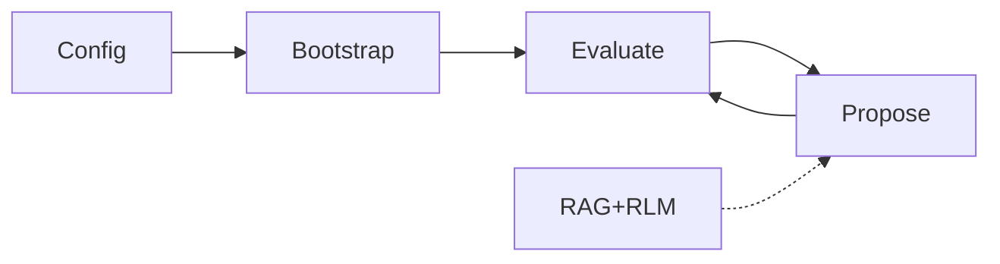
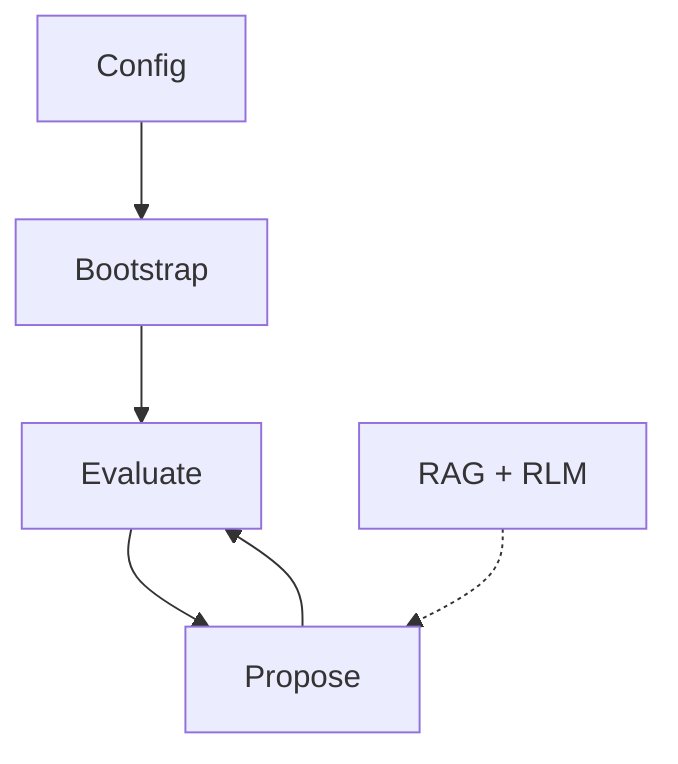

# EcholoKernel Agent Architecture — Slide Summary

Copy the Mermaid block below to [mermaid.live](https://mermaid.live) → Export as PNG/SVG for Google Slides.

## Recommended (fits 16:9 slide)

```mermaid
%%{init: {'theme':'dark'}}%%
flowchart LR
    C[Config] --> B[Bootstrap]
    B --> E[Evaluate]
    E --> P[Propose]
    P --> E
    
    subgraph Retrieval
        R[RAG + RLM]
    end
    R -.-> P
    
    subgraph State
        M[Memory]
    end
    M -.-> P
    
    style C fill:#475569
    style B fill:#475569
    style E fill:#475569
    style P fill:#475569
    style M fill:#475569
    style R fill:#475569
    style State fill:#334155
    style Retrieval fill:#334155
```

## Compact (minimal labels)

## Vertical (narrow layout)

