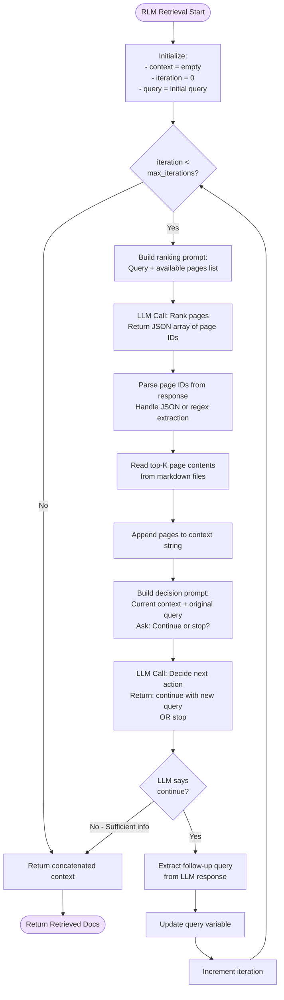
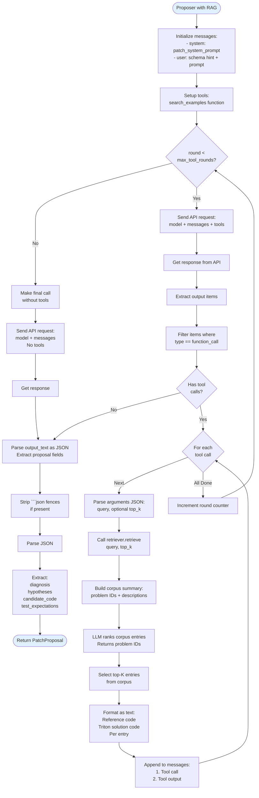
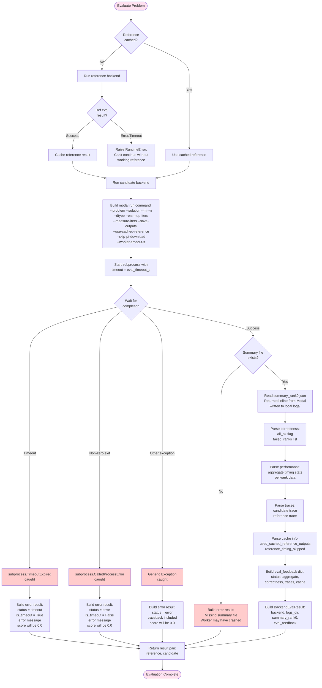
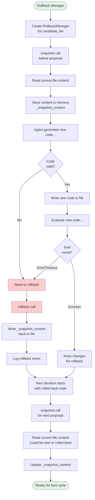
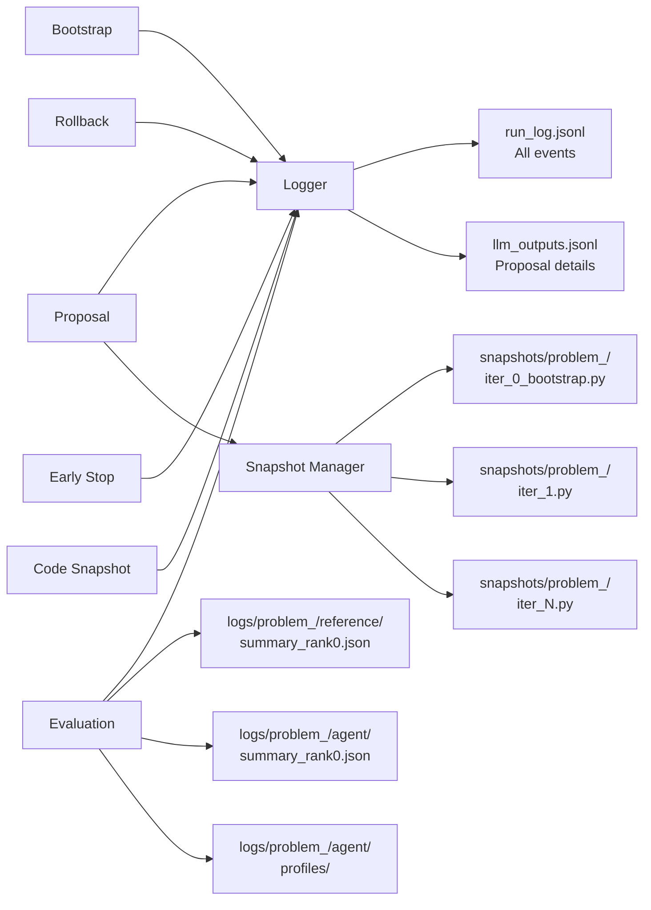
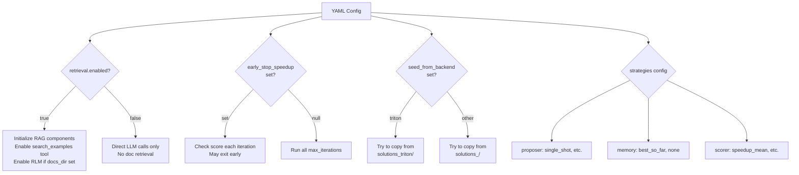

# EcholoKernel Agent: Detailed Execution Flow

This document provides an exhaustive view of the agent's complete execution flow, including all decision points, retrieval mechanisms, and error handling paths.

## How to View the Mermaid Diagrams

Mermaid diagrams are embedded in fenced code blocks (```mermaid). To visualize them:

1. **GitHub / GitLab** — Mermaid renders automatically when viewing this `.md` file in the web UI.
2. **VS Code / Cursor** — Install the [Mermaid Preview](https://marketplace.visualstudio.com/items?itemName=bierner.markdown-mermaid) extension, then use "Open Preview" (Cmd+Shift+V / Ctrl+Shift+V) on this file.
3. **Online** — Copy a diagram block to [mermaid.live](https://mermaid.live) and paste to render or export as PNG/SVG.
4. **Other editors** — Many Markdown editors (Typora, Obsidian, etc.) render Mermaid natively.

## Complete Agent Execution Flow

```mermaid
flowchart TD
    Start([Start Experiment]) --> LoadConfig[Load YAML Config]
    LoadConfig --> InitOptimizer[Initialize Optimizer]
    
    InitOptimizer --> CheckRetrieval{Retrieval<br/>Enabled?}
    CheckRetrieval -->|Yes| InitTritonCorpus[Initialize Triton Corpus<br/>Load reference+solution pairs]
    CheckRetrieval -->|Yes| InitLLMRetriever[Initialize LLM Retriever<br/>For example kernel ranking]
    CheckRetrieval -->|No| SkipRAG[No RAG Retrieval]
    
    InitTritonCorpus --> CheckDocs{Docs Dir<br/>Exists?}
    InitLLMRetriever --> CheckDocs
    SkipRAG --> InitOpenAI
    
    CheckDocs -->|Yes| InitDocsCorpus[Initialize Docs Corpus<br/>Load markdown pages + manifest]
    CheckDocs -->|No| SkipRLM[No RLM Retrieval]
    
    InitDocsCorpus --> InitRLMRetriever[Initialize RLM Retriever<br/>For recursive doc search]
    InitRLMRetriever --> InitOpenAI[Initialize OpenAI Client]
    SkipRLM --> InitOpenAI
    
    InitOpenAI --> InitBootstrap[Initialize Bootstrap Stage]
    InitBootstrap --> InitProposer[Initialize Proposer<br/>with optional retriever]
    InitProposer --> InitMemory[Initialize Memory Strategy<br/>e.g., best_so_far]
    InitMemory --> InitScorer[Initialize Scorer<br/>e.g., speedup_mean]
    InitScorer --> InitEvaluator[Initialize Modal Evaluator]
    InitEvaluator --> CreateRunDir[Create Run Directory<br/>with timestamp]
    CreateRunDir --> InitLogger[Initialize RunLogger<br/>JSONL output]
    
    InitLogger --> BootstrapPhase[BOOTSTRAP PHASE]
    
    BootstrapPhase --> BootLoop{For each<br/>problem}
    
    BootLoop -->|Next Problem| CheckCandidateExists{Candidate<br/>file exists?}
    
    CheckCandidateExists -->|Yes| LogSkipped[Log: bootstrap_skipped_existing]
    CheckCandidateExists -->|No| CheckSeedExists{Seed file<br/>exists?}
    
    CheckSeedExists -->|Yes| CopySeed[Copy from solutions_<backend>/<br/>e.g., solutions_triton/]
    CheckSeedExists -->|No| GenerateNew[Generate from scratch]
    
    CopySeed --> LogSeedCopy[Log: bootstrap_seed_copy]
    
    GenerateNew --> LoadReference[Load reference implementation<br/>from reference/<id>.py]
    LoadReference --> CollectContext[Collect context examples<br/>from other solved problems]
    CollectContext --> BootstrapRLMCheck{RLM Retriever<br/>available?}
    
    BootstrapRLMCheck -->|Yes| BootstrapRLMQuery[Build RLM Query:<br/>Problem ID + Reference snippet]
    BootstrapRLMCheck -->|No| BootstrapNoRLM[No docs retrieved]
    
    BootstrapRLMQuery --> BootstrapRLMCall[Call RLM.retrieve<br/>Recursive doc search]
    
    BootstrapRLMCall --> BootstrapRLMIter{Iteration < Max?}
    BootstrapRLMIter -->|Yes| RLMSelectPages[LLM selects relevant pages<br/>based on query]
    RLMSelectPages --> RLMReadPages[Read page contents]
    RLMReadPages --> RLMAppendContext[Append to context]
    RLMAppendContext --> RLMGenerateFollowup[LLM generates follow-up query<br/>or decides to stop]
    RLMGenerateFollowup --> RLMContinue{Continue<br/>search?}
    RLMContinue -->|Yes| BootstrapRLMIter
    RLMContinue -->|No| RLMConcatDocs[Concatenate all retrieved docs]
    BootstrapRLMIter -->|No| RLMConcatDocs
    
    RLMConcatDocs --> BootstrapBuildPrompt
    BootstrapNoRLM --> BootstrapBuildPrompt[Build Bootstrap Prompt:<br/>- Reference code<br/>- Context examples<br/>- Retrieved docs]
    
    BootstrapBuildPrompt --> BootstrapLLMCall[LLM: Generate Initial Candidate<br/>Returns JSON with candidate_code]
    BootstrapLLMCall --> ValidateBootstrap{Valid code?<br/>Has 'def solution'?}
    
    ValidateBootstrap -->|No| BootstrapError[Raise RuntimeError:<br/>Invalid bootstrap]
    ValidateBootstrap -->|Yes| WriteCandidate[Write to solutions_agent/<id>_agent.py]
    
    WriteCandidate --> LogGenerated[Log: bootstrap_generated]
    LogGenerated --> SnapshotIter0[Save snapshot:<br/>snapshots/problem_<id>/iter_0_bootstrap.py]
    LogSkipped --> SnapshotIter0
    LogSeedCopy --> SnapshotIter0
    
    SnapshotIter0 --> AdvanceProgress1[Advance Progress Bar]
    AdvanceProgress1 --> BootLoop
    
    BootLoop -->|All Done| PrecomputeRefs[Precompute Reference Results]
    
    PrecomputeRefs --> RefLoop{For each<br/>problem}
    RefLoop -->|Next| RunRefBackend[Run Modal:<br/>reference backend<br/>e.g., solutions_reference/<id>_reference.py]
    
    RunRefBackend --> RefModalCmd[modal run run_modal.py<br/>--problem <id><br/>--solution reference<br/>--warmup-iters --measure-iters<br/>--worker-timeout-s]
    
    RefModalCmd --> RefWait{Subprocess<br/>completes?}
    
    RefWait -->|Timeout| RefTimeoutError[Raise RuntimeError:<br/>Reference eval timed out]
    RefWait -->|Error| RefCrashError[Raise RuntimeError:<br/>Reference eval failed]
    RefWait -->|Success| RefParseSummary[Parse summary_rank0.json<br/>Returned inline from Modal<br/>no 2nd container needed]
    
    RefParseSummary --> RefExtractMetrics[Extract:<br/>- Correctness<br/>- Timing stats<br/>- Profiling traces]
    RefExtractMetrics --> RefCache[Cache reference result]
    RefCache --> RefLoop
    
    RefLoop -->|All Done| AdvanceProgress2[Advance Progress Bar]
    AdvanceProgress2 --> MainIterLoop[MAIN ITERATION LOOP]
    
    MainIterLoop --> IterCheck{Iteration <<br/>max_iterations?}
    
    IterCheck -->|No| EndExperiment[End Experiment]
    IterCheck -->|Yes| EvaluateAll[EVALUATE ALL CANDIDATES]
    
    EvaluateAll --> EvalProblemLoop{For each<br/>problem}
    
    EvalProblemLoop -->|Next| GetCachedRef[Get cached reference result]
    GetCachedRef --> RunCandidateBackend[Run Modal:<br/>candidate backend<br/>solutions_agent/<id>_agent.py]
    
    RunCandidateBackend --> CandModalCmd[modal run run_modal.py<br/>--problem <id><br/>--solution agent<br/>--use-cached-reference<br/>--skip-pt-download<br/>--save-outputs]
    
    CandModalCmd --> CandWait{Subprocess<br/>completes?}
    
    CandWait -->|Timeout after eval_timeout_s| MakeTimeoutResult[Create Error Result:<br/>status=timeout<br/>is_timeout=True<br/>error message]
    CandWait -->|CalledProcessError| MakeCrashResult[Create Error Result:<br/>status=error<br/>is_timeout=False<br/>error message]
    CandWait -->|Other Exception| MakeExceptionResult[Create Error Result:<br/>Unexpected error]
    CandWait -->|Success| CheckSummaryExists{Summary file<br/>exists?}
    
    CheckSummaryExists -->|No| MakeMissingResult[Create Error Result:<br/>Missing summary file]
    CheckSummaryExists -->|Yes| ParseCandSummary[Parse summary_rank0.json<br/>Returned inline from Modal<br/>written to local logs/]
    
    MakeTimeoutResult --> StoreEvalResult
    MakeCrashResult --> StoreEvalResult
    MakeExceptionResult --> StoreEvalResult
    MakeMissingResult --> StoreEvalResult
    ParseCandSummary --> ExtractCandMetrics[Extract:<br/>- Correctness status<br/>- Failed ranks<br/>- Timing aggregates<br/>- Traces]
    
    ExtractCandMetrics --> StoreEvalResult[Store evaluation result]
    StoreEvalResult --> EvalProblemLoop
    
    EvalProblemLoop -->|All Done| ScoreAll[Score All Results]
    
    ScoreAll --> ScoreLoop{For each<br/>result}
    ScoreLoop -->|Next| CheckEvalFailed{Eval failed?<br/>error or timeout}
    
    CheckEvalFailed -->|Yes| AssignZeroScore[Assign score = 0.0<br/>Log eval failure]
    CheckEvalFailed -->|No| CallScorer[Call Scorer.score<br/>reference vs candidate]
    
    CallScorer --> SpeedupCalc[Speedup Mean Scorer:<br/>ref_time / cand_time]
    SpeedupCalc --> StoreScore[Store score]
    AssignZeroScore --> StoreScore
    
    StoreScore --> LogEvalEntry[Log evaluation entry to JSONL]
    LogEvalEntry --> ScoreLoop
    
    ScoreLoop -->|All Done| ComputeMeanScore[Compute mean score<br/>across all problems]
    ComputeMeanScore --> AdvanceProgress3[Advance Progress Bar]
    
    AdvanceProgress3 --> CheckEarlyStop{early_stop_speedup<br/>set AND<br/>score >= threshold?}
    
    CheckEarlyStop -->|Yes| LogEarlyStop[Log: early_stop event]
    LogEarlyStop --> EndExperiment
    
    CheckEarlyStop -->|No| ProposalPhase[PROPOSAL PHASE]
    
    ProposalPhase --> PropLoop{For each<br/>problem}
    
    PropLoop -->|Next| TakeSnapshot[Take rollback snapshot<br/>of current candidate file]
    
    TakeSnapshot --> CheckLatestFailed{Latest eval<br/>failed?}
    
    CheckLatestFailed -->|Yes| CaptureFailedCode[Capture failed code from file<br/>BEFORE rollback]
    CaptureFailedCode --> ExecuteRollback[Rollback to previous version<br/>Log: rollback_after_eval_failure]
    CheckLatestFailed -->|No| SkipRollback[No rollback needed]
    
    ExecuteRollback --> TakeSnapshotAgain[Take new snapshot<br/>after rollback]
    TakeSnapshotAgain --> DetermineMode
    SkipRollback --> DetermineMode[Determine Proposal Mode]
    
    DetermineMode --> CheckCorrectness{Eval failed OR<br/>correctness.all_ok<br/>== False?}
    
    CheckCorrectness -->|Yes| SetCorrectMode[Mode = correctness_fix]
    CheckCorrectness -->|No| SetPerfMode[Mode = perf_opt]
    
    SetCorrectMode --> BuildProposalContext
    SetPerfMode --> BuildProposalContext[Build Proposal Context:<br/>- problem_id, candidate_file<br/>- current_code (rolled-back if failed)<br/>- latest_metrics, proposal_mode<br/>- failed_code if eval failed]
    
    BuildProposalContext --> GetMemorySummary[Get Memory Summary<br/>from history]
    
    GetMemorySummary --> MemoryStrategy{Memory<br/>Strategy}
    MemoryStrategy -->|best_so_far| BuildIterationTimeline[Build iteration timeline:<br/>per-iter success/failure<br/>error snippets for failures<br/>timing stats for successes]
    MemoryStrategy -->|none| NoMemory[Return empty summary]
    
    BuildIterationTimeline --> FormatMemorySummary[Format as text summary]
    NoMemory --> FormatMemorySummary
    
    FormatMemorySummary --> PropRLMCheck{RLM Retriever<br/>available?}
    
    PropRLMCheck -->|Yes| BuildRLMQuery[Build RLM Query from Eval Feedback:<br/>- Problem ID + mode<br/>- Correctness issues<br/>- Error messages<br/>- is_timeout hints<br/>- Code excerpt 800 chars]
    PropRLMCheck -->|No| PropNoRLM[retrieved_docs = empty]
    
    BuildRLMQuery --> PropRLMCall[Call RLM.retrieve<br/>Feedback-driven doc search]
    
    PropRLMCall --> PropRLMIter{Iteration < Max?}
    PropRLMIter -->|Yes| PropRLMSelectPages[LLM selects pages<br/>based on error signals]
    PropRLMSelectPages --> PropRLMReadPages[Read page contents]
    PropRLMReadPages --> PropRLMAppendContext[Append to context]
    PropRLMAppendContext --> PropRLMGenerateFollowup[LLM generates targeted<br/>follow-up or stops]
    PropRLMGenerateFollowup --> PropRLMContinue{Continue<br/>search?}
    PropRLMContinue -->|Yes| PropRLMIter
    PropRLMContinue -->|No| PropRLMConcat[Concatenate all retrieved docs]
    PropRLMIter -->|No| PropRLMConcat
    
    PropRLMConcat --> AddRLMContext[Add retrieved_docs<br/>to ProposalContext]
    PropNoRLM --> AddRLMContext
    
    AddRLMContext --> SelectTemplate{Proposal<br/>Mode?}
    
    SelectTemplate -->|correctness_fix| UseCorrectTemplate[Use correctness_patch_template:<br/>Prioritize matching reference outputs]
    SelectTemplate -->|perf_opt| UsePerfTemplate[Use performance_patch_template:<br/>Focus on runtime improvement]
    
    UseCorrectTemplate --> FormatPrompt[Format prompt with:<br/>- Template<br/>- Problem ID, candidate file<br/>- Memory summary<br/>- Retrieved docs<br/>- Latest metrics<br/>- Eval feedback<br/>- Current code<br/>- Append failed_code block if present]
    UsePerfTemplate --> FormatPrompt
    
    FormatPrompt --> CheckRAG{RAG Retriever<br/>available?}
    
    CheckRAG -->|Yes| LLMWithTools[LLM Call with Tools<br/>Tool: search_examples]
    CheckRAG -->|No| LLMDirect[Direct LLM Call<br/>No tools]
    
    LLMWithTools --> ToolRound{Tool call<br/>round < max?}
    
    ToolRound -->|Yes| SendLLMRequest[Send to OpenAI API:<br/>messages + tools<br/>model + temperature]
    
    SendLLMRequest --> LLMResponse{Response<br/>type?}
    
    LLMResponse -->|Tool calls| ProcessToolCalls[Process each tool call]
    LLMResponse -->|Text response| ParseProposalJSON
    
    ProcessToolCalls --> ExtractToolArgs[Extract arguments:<br/>query, optional top_k]
    ExtractToolArgs --> CallRetriever[Call LLMRetriever.retrieve]
    
    CallRetriever --> RankCorpus[Rank corpus entries<br/>using LLM]
    RankCorpus --> RAGLLMCall[LLM ranks problem IDs<br/>by relevance to query]
    RAGLLMCall --> SelectTopK[Select top-K entries]
    SelectTopK --> FormatEntries[Format as:<br/>Problem ID<br/>Reference code<br/>Triton solution code]
    
    FormatEntries --> AppendToolResult[Append tool call +<br/>output to messages]
    AppendToolResult --> ToolRound
    
    ToolRound -->|No more rounds| FinalLLMCall[Final LLM call<br/>without tools<br/>Force text response]
    FinalLLMCall --> ParseProposalJSON
    
    LLMDirect --> DirectLLMCall[Send to OpenAI API:<br/>system prompt + user prompt<br/>No tools]
    DirectLLMCall --> ParseProposalJSON[Parse JSON Response]
    
    ParseProposalJSON --> StripFences[Strip markdown fences<br/>if present]
    StripFences --> ParseJSON[json.loads text]
    ParseJSON --> ExtractFields[Extract:<br/>- diagnosis string[]<br/>- hypotheses string[]<br/>- candidate_code string<br/>- test_expectations string[]]
    
    ExtractFields --> CreateProposal[Create PatchProposal object]
    CreateProposal --> LogLLMOutput[Log to llm_outputs.jsonl:<br/>- iteration<br/>- problem_id<br/>- proposal_mode<br/>- model<br/>- diagnosis<br/>- hypotheses<br/>- test_expectations<br/>- candidate_code]
    
    LogLLMOutput --> LogCycleEvent[Log event:<br/>perf_opt_cycle or<br/>correctness_fix_cycle]
    
    LogCycleEvent --> ValidateProposal{Proposal<br/>valid?}
    
    ValidateProposal -->|Code empty| PropRollback[Rollback to snapshot<br/>Log: proposal_failed]
    ValidateProposal -->|No 'def solution'| PropRollback
    ValidateProposal -->|Valid| WriteNewCode[Write candidate_code to<br/>solutions_agent/<id>_agent.py]
    
    WriteNewCode --> SaveIterSnapshot[Save snapshot:<br/>snapshots/problem_<id>/iter_<n>.py]
    SaveIterSnapshot --> LogApplied[Log: proposal_applied<br/>with snapshot path]
    
    PropRollback --> AdvanceProgress4[Advance Progress Bar]
    LogApplied --> AdvanceProgress4
    
    AdvanceProgress4 --> PropLoop
    
    PropLoop -->|All Done| IncrementIter[Increment iteration counter]
    IncrementIter --> MainIterLoop
    
    EndExperiment --> WriteSummary[Write summary.json:<br/>- name<br/>- run_dir<br/>- iterations count]
    WriteSummary --> PrintPaths[Print output paths:<br/>- llm_outputs.jsonl<br/>- snapshots/<br/>- run_log.jsonl]
    PrintPaths --> End([Experiment Complete])
    
    style Start fill:#e1f5e1
    style End fill:#e1f5e1
    style BootstrapPhase fill:#fff4e1
    style MainIterLoop fill:#e1f0ff
    style EvaluateAll fill:#ffe1f0
    style ProposalPhase fill:#f0e1ff
    style EndExperiment fill:#e1f5e1
```

## Key Components Detailed

### 1. RLM (Recursive Language Model) Retrieval Process



### 2. RAG Tool-Use Cycle During Proposal



### 3. Evaluation with Error Handling



### 4. Memory Strategy - Best So Far

The memory strategy provides a structured iteration history so the LLM can see what worked and what failed.

```mermaid
flowchart TD
    Start([Memory.summarize]) --> Input[Input: history list of dicts<br/>Each entry has:<br/>iteration, problem_id,<br/>score, eval_failed, eval_error<br/>candidate_feedback, etc.]
    
    Input --> FindBest[Find best entry by score<br/>across all history]
    
    FindBest --> BuildSummary[Build text summary]
    
    BuildSummary --> AddBestLine[Add: Best iteration so far<br/>iter X score=Y]
    
    AddBestLine --> AddLatestLine[Add: Latest iteration<br/>iter Z score=W]
    
    AddLatestLine --> FormatLoop{For each recent<br/>entry (last 6)}
    
    FormatLoop -->|Next| CheckFailed{Eval failed?}
    
    CheckFailed -->|Yes| FormatFailed[Format: iter N FAILED<br/>error_type — error snippet]
    CheckFailed -->|No| FormatSuccess[Format: iter N score=X<br/>correct/INCORRECT<br/>cand_ms, ref_ms]
    
    FormatFailed --> AppendText[Append to summary]
    FormatSuccess --> AppendText
    
    AppendText --> FormatLoop
    
    FormatLoop -->|All Done| AddGuidance[Add: Avoid repeating<br/>failed approaches...]
    
    AddGuidance --> ReturnSummary[Return formatted summary<br/>to include in proposal prompt]
    
    ReturnSummary --> End([Memory Summary])
    
    style Start fill:#fff4e1
    style End fill:#fff4e1
```

### 5. Rollback Manager



## Decision Points Summary

| Decision Point | Condition | Path A | Path B |
|---------------|-----------|--------|--------|
| **Bootstrap** | Candidate exists? | Skip (use existing) | Check seed or generate |
| **Bootstrap** | Seed exists? | Copy seed file | Generate from scratch |
| **Bootstrap RLM** | RLM enabled? | Retrieve docs | No docs |
| **Proposal RLM** | RLM enabled? | Retrieve docs | No docs |
| **Proposal RAG** | RAG enabled? | LLM with tools | Direct LLM |
| **Proposal Mode** | Correctness OK? | perf_opt | correctness_fix |
| **Template** | Mode = correctness? | correctness_patch_template | performance_patch_template |
| **Tool Response** | Model calls tool? | Execute retrieval | Parse text |
| **Eval Wait** | Subprocess result? | Parse success | Handle error/timeout |
| **Eval Result** | Status = error/timeout? | Score = 0.0, log failure | Calculate speedup score |
| **Early Stop** | Score >= threshold? | End experiment | Continue iterations |
| **Rollback Check** | Latest eval failed? | Capture failed_code, then rollback | No rollback |
| **Code Valid** | Has 'def solution'? | Apply code | Rollback |
| **Memory** | Strategy = best_so_far? | Build iteration timeline (success/failure, errors) | Return empty |
| **RLM Iteration** | iteration < max? | Continue search | Return results |
| **RLM Decision** | LLM says continue? | Generate follow-up query | Stop search |
| **RAG Round** | round < max_tool_rounds? | Allow tool calls | Force text response |

## Error Handling Paths

### Bootstrap Errors
- **Missing reference file** → RuntimeError (can't bootstrap without reference)
- **Empty LLM output** → RuntimeError (bootstrap failed)
- **No 'def solution'** → RuntimeError (invalid bootstrap)

### Evaluation Errors
- **Subprocess timeout** → Error result (status=timeout, score=0.0)
- **Subprocess crash** → Error result (status=error, score=0.0)
- **Missing summary file** → Error result (worker crashed)
- **Reference eval failure** → RuntimeError (can't continue without reference)

### Proposal Errors
- **Empty candidate_code** → ValueError, rollback
- **No 'def solution'** → ValueError, rollback
- **JSON parse error** → Exception, rollback

### Retrieval Errors
- **RLM parse failure** → Fallback: regex extract IDs
- **RAG parse failure** → Fallback: return first top_k entries
- **Corpus empty** → Return "No entries available"

## Logging & Persistence

Every significant event is logged to `run_log.jsonl`:



## Configuration Impact on Flow

Different config settings change which paths are taken:



---

**Key Insights:**

1. **RLM is recursive**: It can call itself multiple times to narrow down documentation
2. **RAG is iterative**: The LLM can call the search tool multiple times in one proposal
3. **Rollback is preventive**: Always snapshot before changes, rollback on any failure
4. **Mode switching is automatic**: Correctness issues trigger correctness_fix mode
5. **Early stopping is optional**: Config can halt when speedup target is reached
6. **Everything is logged**: Complete audit trail of all decisions and code evolution
7. **Failed code is surfaced**: When eval fails, the LLM sees the broken code (captured before rollback) plus the error, so it can learn from mistakes
8. **Memory is iterative**: BestSoFarMemory now provides a per-iteration timeline (success/failure, error snippets, timing) so the LLM has context across attempts

### Speed Optimizations (Modal)

- **Inline JSON**: `run_distributed_eval` returns JSON file contents in its result dict; no second container (`download_logs`) needed for the optimizer loop
- **Skip .pt download**: Evaluator passes `--skip-pt-download`; `.pt` files stay on the Modal volume for cached-reference usage
- **Skip reference profiling**: When `--skip_reference_timing` (cached reference), the worker only profiles the candidate, not the reference
- **`.modalignore`**: Excludes `logs/`, `runs/`, `__pycache__/`, etc. from the image layer to reduce rebuild time

This detailed flow shows every branch, every decision point, and every error path in the EcholoKernel agent system.
