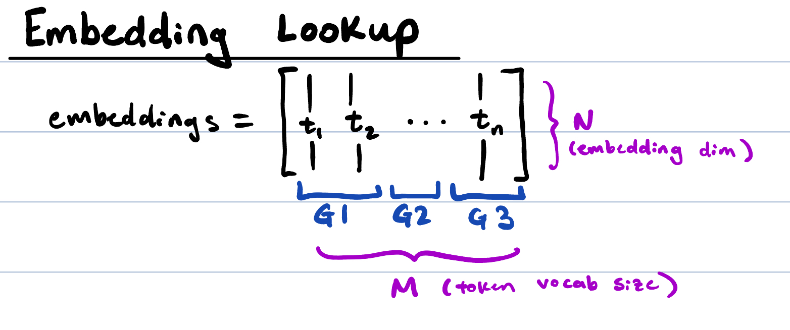
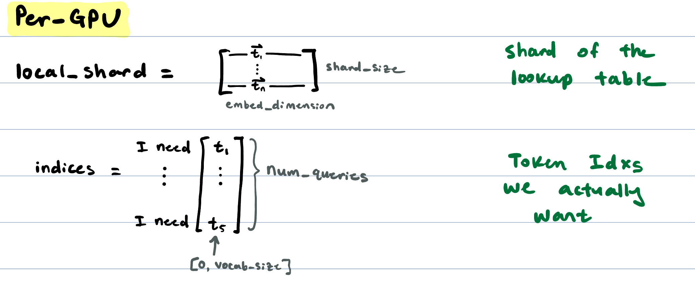
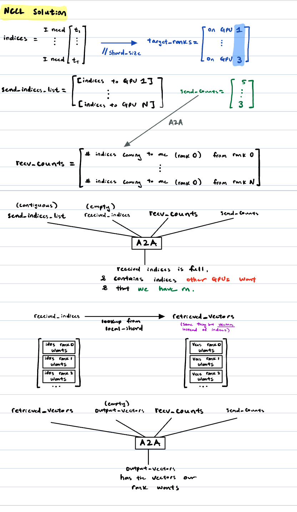
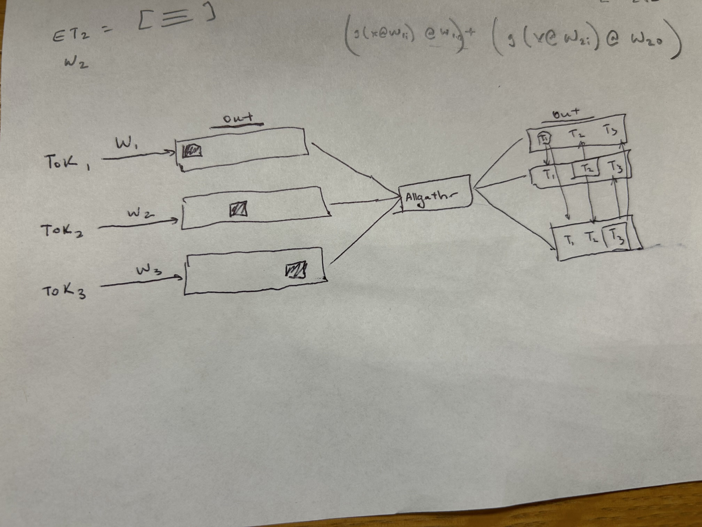
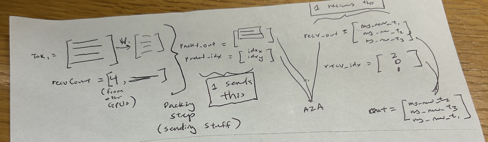

# Each of the Problems, explained

## Problem 10
This is meant to be the first "non-trivial" demonstration problem showing how fine-grained comms can beat naive collective operations.

### *High-Level Problem Setup*
We have an M x N (vocab_size x embedding_dim) matrix that represents our embedding vectors for each token. This is evenly sharded in order along vocab_size across all of our GPUs. So think of it as our lookup table for embeddings being distributed across multiple GPUs.

Per-GPU, we have our own local shard of the lookup table, and a list of tokens we actually want (queries).

### *Naive Method*
This is awkward for A2A operations, because first we need to do an A2A to find the number of token indices coming to me from all other ranks.

Then we use this to do another A2A operation to get all of the token *indices* that GPU X will be getting. But this is not the embeddings, so we need to do yet another A2A to actually get the right token embedding vector based on these indices. So there's a lot of packing and index operations being done!

## 50-level MoE problems
MoE seems to break down into: dispatch kernel, computation per expert, combine kernel.

Each 50-level problem takes care of one or two or multiple of these parts.

TODO: add other kinds of expert computation to the compute + combine kernels

### 50_simple [compute + combine]
This is the simplest case: each expert has its set of tokens already in order. They each apply some expert function (e.g. GEMM) and then allgather so that every expert has every other expert's transformed tokens.

This assumes the tokens given to each expert are in sequence order, which is obv not always true.

**TRICK:** Chunk the token input along the sequence dimension, so I can compute on a subset of tokens, and then pipeline allgather those while I compute the next subset of tokens. 

### 50 [compute + combine]
Irregular AlltoAll case, NOT AllGather. Here, we also have to pass in the dst rank and indices, and then do a bunch of AlltoAlls to exchange the info correctly.

**TRICK:** Just use NVSHMEM and heavy pipelining to exchange the information, not using 3 AllToAlls.

### 51 dispatch
Unified general dispatch script using alltoall.

KNOBS:
- expert_assignments - Per-token expert assignments.
- top_k =  Number of experts each token routes to.
- experts_per_gpu =  Number of experts per GPU

# 100-level MoE problems
Currently covers:
1. ranks = experts. EP
2. ranks < experts. EP + TP
3. ranks > experts. EP + expert sharding

TODO: others to include?
- using many many tiny experts, covered in case 2?? Dispatch becomes the bottleneck
- DeepSeek uses shared expert that processes every single token
- Different kinds of compute, like experts doing different things???

## Problem 100 - Full MoE. (ranks = experts). EP.
Does the dispatch + compute + combine step one after the other with a bunch of AllToAlls.

Assumes 1 expert / GPU.

"compute" is:   Gelu(x @ w1) @ w2

KNOBS YOU CAN TURN:
1. expert_assignments - which experts get what tokens
2. top_k - each token routes to top K experts
3. gate_weights - weight you apply to each token after the combine step
4. capacity_factor - MAX number of tokens that can be routed to each expert: excess is zeroed out. Set to Ceil(T * capacity_factor)

**TRICK:** 100_pipelining.py shows what this looks like with overlapped dispatch combine using NCCL cuda streams...

## Problem 101 - Full MoE. (ranks < experts). EP + TP
Experts spread across multiple GPUs. Expert A's weights are sharded across a TP gorup. We have to make separate communicator groups.

Layout (example: world_size=8, tp_size=2, ep_size=4):
    Expert 0: ranks [0, 1]  (TP group)
    Expert 1: ranks [2, 3]
    Expert 2: ranks [4, 5]
    Expert 3: ranks [6, 7]

    EP group A: ranks [0, 2, 4, 6]  (TP position 0)
    EP group B: ranks [1, 3, 5, 7]  (TP position 1)

KNOBS:
1. expert_assignments - which experts get what tokens
2. tp_size - Tensor-parallel degree within each expert. ep_size (number of experts) = world_size // tp_size.
TODO: add top_k, gate_weights, capacity_factor, etc.

## Problem 102 - Full MoE. (ranks > experts). EP + Expert Sharding
Each GPU has multiple experts, each with full weights. 

KNOBS:
0. x = original tokens on this rank.
1. expert_assignments - per token expert assignment.
2. w1_list/w2_list - weights for ALL experts on this rank in the form of a list.
3. experts_per_gpu - num_experts == world_size * experts_per_gpu.
4. top_k - number of experts each token routes to
5. gate_weights - weight you apply to each token after the combine step
6. capacity_factor - MAX number of tokens that can be routed to each expert: excess is zeroed out. Set to Ceil(T * capacity_factor)
